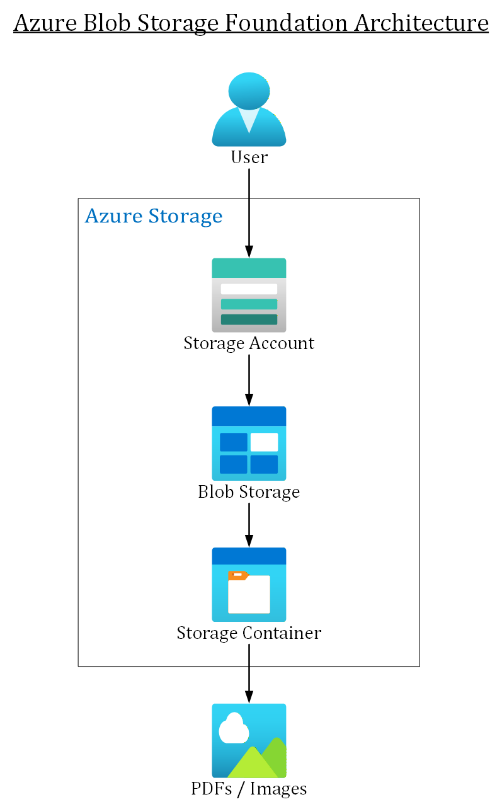
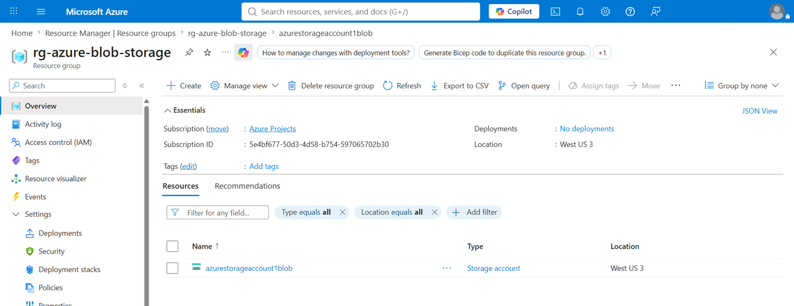
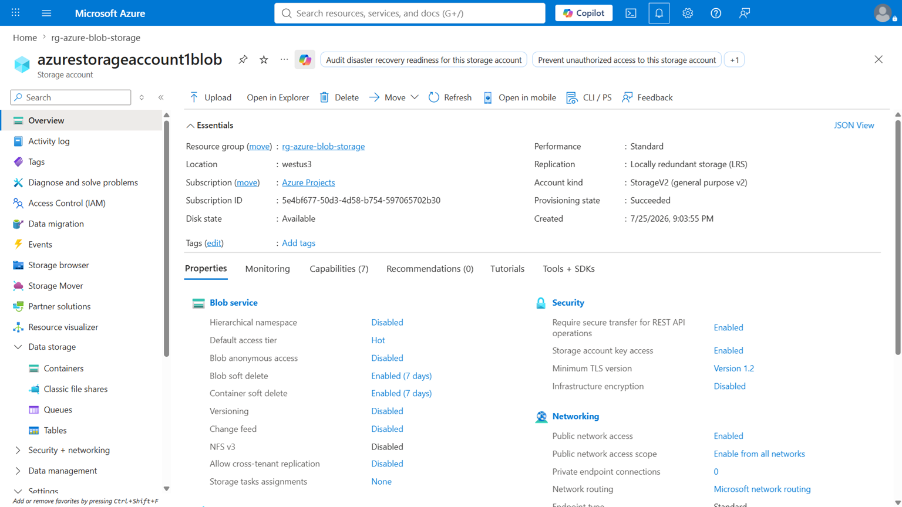
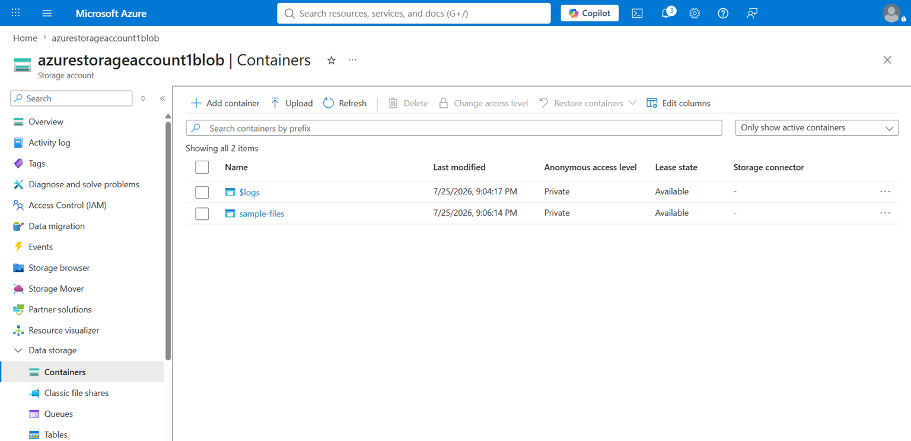
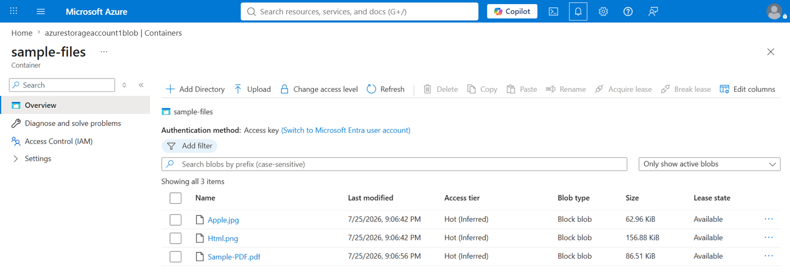
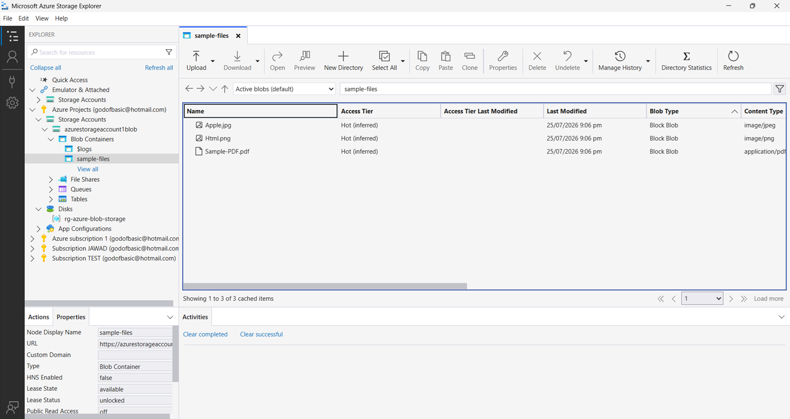

# Azure Blob Storage

## Overview

This project demonstrates a basic Azure cloud storage solution using Azure Blob Storage.

The objective is to design and implement a simple, scalable, and reliable cloud storage architecture for storing documents, images, and other files using Microsoft Azure.

This project focuses on understanding Azure Storage hierarchy, Blob Storage concepts, Azure resource organization, and documenting cloud implementations.

---

## Architecture

The solution consists of:

- User
- Azure Storage Account
- Azure Blob Storage
- Blob Container
- Blob Objects (documents, images, and other files)

Architecture flow:

User → Azure Storage Account (Blob Service) → Blob Container → Blobs

---

## Architecture Diagram

---

## Azure Services Used

- Azure Storage Account
- Azure Blob Storage
- Azure Blob Container
- Azure Storage Explorer

---

| Resource Type | Resource Name |
|---|---|
| Resource Group | rg-azure-blob-storage |
| Storage Account | azurestorageaccount1blob |
| Blob Container | sample-files |
| Region | West US 3 |

---

# Screenshots

## 1. Resource Group Overview

---

## 2. Blob Storage Settings

---

## 3. Blob Containers List

Note:
- `$logs` is an Azure-managed system container.
- `sample-files` is the project Blob container created for application data.

---

## 4. Blob Container with Uploaded Files

---

## 5. Azure Storage Explorer Verification

---

## Learning Outcomes

- Understanding Azure Storage hierarchy
- Understanding the relationship between Storage Accounts, Containers, and Blobs
- Learning basic cloud architecture design
- Creating and documenting Azure resources
- Using Azure Portal and Azure Storage Explorer
- Building a foundation for future Azure projects

---

## Documentation

Detailed project documentation is available in:

- [Setup Procedure](DeploymentNotes/SetupProcedure.md)
- [Configuration Details](DeploymentNotes/ConfigurationDetails.md)
- [Lessons Learned](Documentation/LessonsLearned.md)
- [Deployment Guide](DeploymentNotes/DeploymentGuide.md)

---

## Project Evolution

This project will evolve through multiple releases:

| Release | Snapshot | Milestone | Status |
|---|---|---|---|
| [v1.0 Release](../../releases/tag/v1.0) | [v1.0 Snapshot](../../tree/v1.0) | Azure Blob Storage Foundation | Completed |
| v2.0 Release | v2.0 Snapshot | C# Console Uploader using Azure SDK | Planned |
| v3.0 Release | v3.0 Snapshot | WinUI 3 Desktop Application | Planned |
| v4.0 Release | v4.0 Snapshot | ASP.NET Core Web API Integration | Planned |
| v5.0 Release | v5.0 Snapshot | Enterprise Features (Entra ID, Key Vault, Monitoring, CI/CD) | Planned |

---

## Future Enhancements

Planned upgrades:

- **V2:** Add C# Console uploader using Azure SDK
- **V3:** Add WinUI 3 frontend
- **V4:** Add ASP.NET Core API
- **V5:** Enterprise version with Entra ID authentication, Key Vault, monitoring, logging, and CI/CD